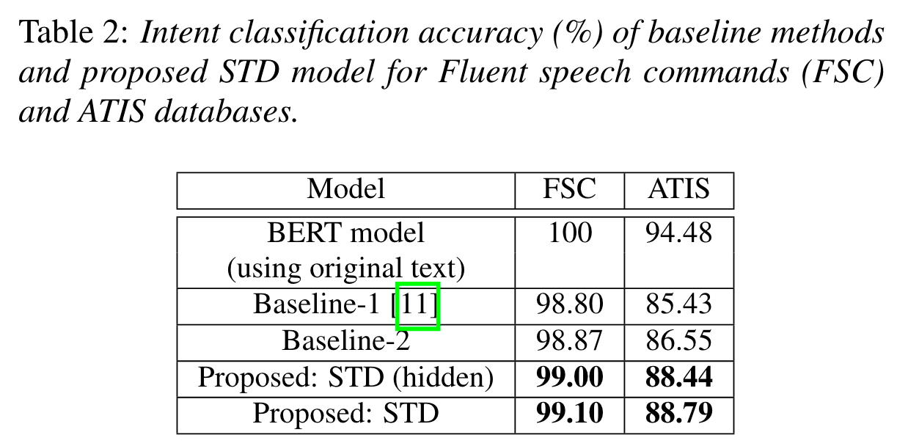

# INTERSPEECH2021

# Knowledge Distillation from BERT Transformer to Speech Transformer for Intent Classification

#papers/CrossModal
#KnowledgeDistillation

link: https://arxiv.org/pdf/2108.02598.pdf

## 核心工作

* 与传统SLU任务中的方法不同（ASR+NLU），去除ASR模块直接通过语音数据来预测意图
	* 难点：缺乏针对语音标注的意图识别数据集，主要在于意图识别中语音方差太大，标注困难
	* 解决方案：跨模态知识蒸馏 
	* 优点：
		* 网络更加紧凑（without using any intermediate ASR modeling）
		* 消除中间转录带来的误差（eliminate the issue caused by intermediate transcription error）
		* 针对影响人类理解口语的韵律、语速和响度等特征具有较强的鲁棒性（human interpretation of a spoken utterance depends on prosody, speech rate, and loudness, which are not considered in the pipeline SLU system）

## 网络架构

蒸馏模型中，**最小化两个方面的距离**：
* attention matrices
* hidden state vector

**三个损失函数**：
* intent loss from ground-truth label, 
* attention loss from the attention based distillation 
* hidden loss from the hidden state based distillation
* $Loss_{total} = \alpha_1 Loss_{intent} + \alpha_2 Loss_{att} + \alpha_3 Loss_{hid}$

**五个模块**：
* Pre-trained ASR Model
	* L. Dong, S. Xu, and B. Xu, “Speech-transformer: A norecurrence sequence-to-sequence model for speech recognition,” in ICASSP, (Calgary, AB), pp. 5884–5888, Apr. 2018.
	* 256维Embedding最为Speech Transformer输入，该部分freeze
* Speech Transformer Encoder
	* 仅使用Encoder层，其中包含MHA和FFN
	* 其中MHA经过Mean Pooling输出Attention Matrices，FFN之后输出为Hidden State Vector
* BERT Embedding and Model
	* 使用BERT预训练模型
	* 与BERT不同的是，加了Attention Matrices 和 Hidden State Vector 和 Hidden State Vector输出
* Transformer-layers Distillation
	* Teacher网络12层，12 heads，768 hidden units；Student网络4层，8 heads，512 hidden units
	* Teacher网络中每3层组成一个块，每块的最后一层蒸馏到Student网络
	* MSE损失计算Attention Matrices距离，对于多头用Mean Pooling来处理
	* Hidden State Vector需要经过一个简单的映射矩阵$W^H \in \mathbb{R}^{S_{dmodal} \times T_{dmodal}}$转为同一维度
* Intent Layer
	* 使用线性层进行分类，使用交叉熵损失

## 实验结果

1. 数据集
* Fluent Speech Corpus: https://www.kaggle.com/datasets/tommyngx/fluent-speech-corpus 
* ATIS

2. 实验参数设置
* $\alpha_1 = 0.625, \alpha_2 = 0.125, \alpha_3 = 0.250$
* set label smooth parameters is 0.1
* Adam optimizer with $\beta_1=0.9, \beta_2=0.98, \epsilon=10^{-9}$
* learning rate scheduling $lr = k \cdot d^{-0.5}_{model} \min\{n^{-0.5}, n\cdot warmup_n^{-1.5} \}$，其中k是可调节表量，n是步数，$warmup_n$大于1时，取$n^{-0.5}$，k参数取值[参考](https://github.com/kaituoxu/Speech-Transformer/blob/e6847772d6a786336e117a03c48c62ecbf3016f6/src/bin/train.py#L79)，$warmup_n$取值[参考](https://github.com/kaituoxu/Speech-Transformer/blob/e6847772d6a786336e117a03c48c62ecbf3016f6/src/bin/train.py#L81)

3. 实验指标
baseline1：ASR之后使用RNN+MP+Linear进行意图识别
baseline2：基于Transformer端到端SLU模型（无蒸馏）
整体性能：比两个baseline好，说明蒸馏效果好，说明Attention Matrices+Hidden State Vector两个方向蒸馏结合效果更好

加噪音：蒸馏后抗噪能力强

整理一下**模型性能**：

|        Models         |  FSC  |  ATIS |
|:---------------------:|:-----:|:-----:|
| BERT Modal(only text) |  100  | 94.48 |
|    STD(Only Hidden)   | 99.00 | 88.44 |
|          STD          | 99.10 | 88.79 |
|     Add Noise(15)     | 95.60 | 86.90 |
|     Add Noise(10)     | 78.90 | 85.86 |
|      Add Noise(5)     | 48.20 | 81.21 |
|      Add Noise(0)     | 17.60 | 72.59 |

## 文章中的相关小论断

1. 说明pretraining+finetune可行性 
> The pre-trained acoustic and linguistic models can be finetuned for the downstream SLU tasks, which is proven to be an effective paradigm [22, 23].

2. 本文这是第一个语音领域Transformer工作：
> L. Dong, S. Xu, and B. Xu, “Speech-transformer: A norecurrence sequence-to-sequence model for speech recognition,” in ICASSP, (Calgary, AB), pp. 5884–5888, Apr. 2018.

3. 说明Self-Attention的性能：
> The self-attention mechanism in the transformer enables the extraction of the semantic context from a spoken utterance.

4. 知识蒸馏应用场景概括：
> The knowledge distillation approach aims to distill the learning capacity of a larger deep neural network (teacher model) to a smaller network (student model)

5. 人类理解对话或口语特点：不依赖所有单词
> As we know human interpretation of conversation or spoken utterance does not equally rely on all words in the utterance.
